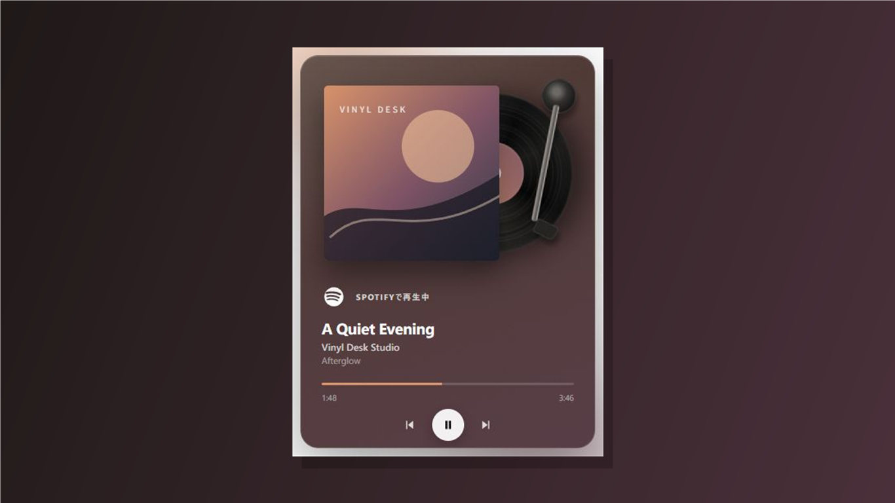
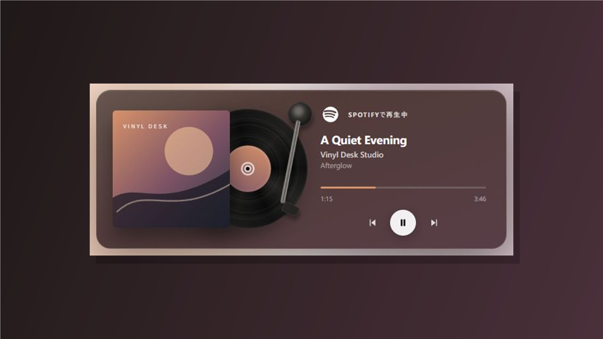

# Vinyl Desk

**デスクトップに、小さなレコードプレーヤーを。**

Windows版Spotifyで聴いている曲を、ジャケットと回転するレコードで楽しめる、Windows 11向けデスクトップウィジェットです。

*画面は架空の楽曲情報とオリジナルのジャケットを使ったデモ表示です。*

## 入手について

Microsoft Storeに申請中です。公開状況は、下記の商品ページでご確認ください。審査中はページが表示されない、または入手できない場合があります。

**[Microsoft Storeの商品ページ](https://apps.microsoft.com/detail/9N453BCDK8CD)**

## できること

- 再生中の曲名・アーティスト・アルバム・ジャケット・再生位置を表示。
- レコードが回転し、ジャケットに合わせて画面の色が変化。
- デスクトップに合わせて縦型・横型のレイアウトを選択。
- 再生・一時停止、前の曲・次の曲への移動、再生位置の変更。
- 好きな場所に配置し、位置を固定。
- 表示項目・外観の調整、自動起動、モーション軽減。
- 日本語・英語・簡体字中国語・繁体字中国語・韓国語に対応。

*横型レイアウト。画面はデモ表示です。*

## 対応環境

- Windows 11（x64）
- 同じPCにインストールしたWindowsデスクトップ版またはMicrosoft Store版Spotify

ブラウザー版Spotifyや、スマートフォン・スマートスピーカーなど別端末だけでの再生は動作保証の対象外です。表示される情報や使える操作は、Spotifyの再生状態などによって異なります。

## 使い方

1. Vinyl Deskを起動します。
2. 同じPCのWindows版Spotifyで音楽を再生します。
3. 再生中の曲がウィジェットに表示されます。

Vinyl Desk内でSpotifyアカウントを接続する操作は不要です。Spotify側では、通常どおり音楽を再生できる状態にしてください。

## よくある質問・サポート

使い方や表示に困ったときは、[よくある質問とサポート](SUPPORT.md)をご覧ください。

## English

**A little record player for your desktop.**

Vinyl Desk is an independent, unofficial Windows 11 desktop widget for Spotify. Enjoy your current track with album artwork, a spinning record, artwork-inspired colors, and portrait or landscape layouts.

Requires Windows 11 (x64) and Spotify for Windows on the same PC. Browser playback and playback occurring only on other devices are not guaranteed. No Spotify account connection is needed inside Vinyl Desk.

Submitted to Microsoft Store; availability is pending. [View the Store listing](https://apps.microsoft.com/detail/9N453BCDK8CD). Screenshots show fictional demo track information.

---

Vinyl Deskは独立した非公式アプリです。SpotifyはSpotify ABの商標であり、本アプリはSpotify ABによる提供、承認、提携製品ではありません。

Vinyl Desk is not provided, endorsed, or affiliated with Spotify AB. Spotify is a trademark of Spotify AB.

Copyright © 2026 Vinyl Desk. All rights reserved.
